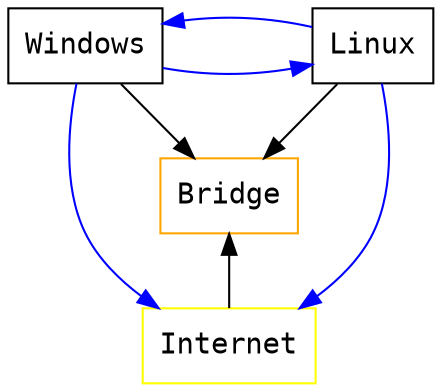

# CentOS7 2/22

###### tags: `Linux` `Sophomore B` `University`

:::info
WINSCP 
protocol:FTP
host name:csie.nqu.edu.tw
passwd:test1234
:::
## 作用於伺服器及機房的遠端連線
設定>顯示>遠端顯示>勾選啟用伺服器>> Port 不能用預設的，會錯誤 >勾選允許多重功能


左下角的搜尋尋找mstsc
開啟遠端桌面連線
因為在本機端進行連線所以遠端桌面連線的電腦(C)欄位輸入127.0.0.1:Server port
遠端桌面連線 輸入 127.0.0.1:Server port

## 關機方式
1. 圖形化
    點擊右上角 > 點擊關機鍵 > 點擊poweroff 
    (若點擊Restart則是重新關機)
2. terminal
    1. $ halt -p
    2. $ poweroff
    3. $ shutdown (must be root)
> shutdown (must be root)
> 利用指令 su 輸入密碼後登入root，便可關機
> su (change to super user)
> shutdown -c //取消關機
> shutdown now //立即關機

## 看檔案內容的方式
gedit //編輯文件(圖形化文字編輯器軟體)
```
$ gedit a.txt
```
1. cat a.txt
2. more a.txt
3. less a.txt

## Network Adapter
課程參考:https://segmentfault.com/a/1190000018641361
在virtual box中最多可選4張網卡

### Bridge Adapter(橋接介面卡)
1. 地位平等(可以互ping)
2. 皆可看到對方
3. 皆可存取Internet
4. 適合架設伺服器(因為linux會直接暴露在網路上，只要windows有連接上網路，Linux就可以連接上網)

> ipconfig: in windows, check the ip address
> ifconfig: in linux, check the ip address settings
> 在linux和windows中使用ping他們都是使用ICMP，不過兩邊的TTL和bytes數不一樣，在linux中ping會一直傳(停止curl+c)，但windows就4次


192.168.1.0/24

### NAT

1. 虛擬機可以看到物理機，但物理機不能看到虛擬機
2. 虛擬機可連到網路，但網際網路無法存取虛擬機
3. 兩個虛擬機之間無法溝通
4. 虛擬機們會在不同的區域網路之下，但ip相同，不過不會互相影響


右鍵點擊再製，複製一份虛擬機


再製出的虛擬機網路選擇NAT，並且將遠端連線關閉，避免產生衝突
1. 虛擬機可以ping本機
2. 本機無法ping虛擬機
3. 兩台NET虛擬機ip位置相同，兩者無法互ping


* Vmware: NAT mode  .. VM can talk to another VM. VM can also talk to windows. Windows can talk to VM
* Virutal Box (NAT mode)  VM cannot talk to another VM. Windows can not talk to VM.

### NAT Network
1. 虛擬機可以互相溝通
2. 虛擬機可以看到物理機
3. 物理機不能看到虛擬機

VirtualBox  
* NAT: vm cannot talk to another VM 
* NAT Network: vm can talk to anther VM

### Host-Only(僅限主機介面卡)
1. 虛擬機複製出一張虛擬網卡
2. 產生一個內部網路
3. 虛擬機可以跟物理機溝通
4. 虛擬機可以互相溝通
5. 虛擬機們與物理機皆具有相同的網路ip
6. 無法連到 Internet


### Internal Network(內部網路)
1. 只有在同網路中的虛擬機才能互相通訊


設定兩台虛擬機網路如下圖後，重啟網路


之後兩台機器就可以互ping了


* Internatl Network: VM can only to another VM that is within the same internal network. No internet connection. Cannnot talk to windows

::: info
課堂建議:第一張網路卡設定為NAT,第二張設定為Host-Only
:::

## 保護虛擬機
### 建立快照

建立一個 Snapshot(快照)
### 還原壞掉前的機器狀態

點擊要還原的 Snapshot > 點擊還原
## 備份虛擬機
### 匯出
1. 
2. 選擇要打包的虛擬機
3. 選擇檔案位置
4. 匯出(副檔名為.ova)

### 匯入

